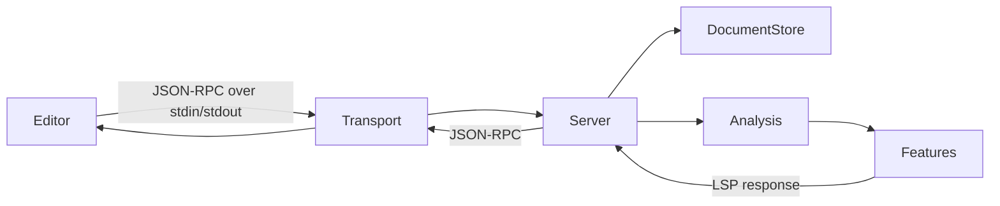

ZLS is a single binary LSP server. It reads JSON-RPC messages from stdin, processes them, and writes responses to stdout. This document describes the internal structure to help you navigate the codebase when contributing.

## High-level flow



1. The transport layer reads raw bytes from stdin and deserializes them into LSP request objects.
2. `Server.zig` dispatches each request to the appropriate feature handler.
3. Feature handlers query the document store and analysis backend to produce a result.
4. The result is serialized and written back to stdout.

## Key source files

```
src/
├── main.zig
├── Server.zig
├── DocumentStore.zig
├── analysis.zig
├── Config.zig
├── analyser/
├── features/
│   ├── completions.zig
│   ├── hover.zig
│   ├── goto.zig
│   └── ...
├── build_runner/
└── tools/
    ├── config.json
    └── config_gen.zig
```

| File / directory | Purpose |
| --- | --- |
| `src/main.zig` | Entry point. Parses CLI arguments, sets up the transport, loads config, and starts the server. |
| `src/Server.zig` | Main server loop. Dispatches incoming LSP requests to feature handlers and manages server state. |
| `src/DocumentStore.zig` | Tracks open documents and the Zig project's file tree. Responsible for incremental document sync and build graph awareness. |
| `src/analysis.zig` | Semantic analysis backend. Handles type resolution, symbol lookup, and scope analysis. |
| `src/analyser/` | New and improved analysis backend, currently in development. Will eventually replace the logic in `analysis.zig`. |
| `src/features/` | One file per LSP capability — completions, hover, go-to-definition, find references, rename, inlay hints, and so on. |
| `src/Config.zig` | Auto-generated configuration struct. Do not edit directly; edit `src/tools/config.json` and regenerate with `src/tools/config_gen.zig`. |
| `src/build_runner/` | Build system integration. Runs `zig build` as a child process and parses its output for build-on-save diagnostics. |

## Dependencies

| Package | Description |
| --- | --- |
| `lsp-kit` | LSP protocol types and the JSON-RPC transport layer ([zigtools/lsp-kit](https://github.com/zigtools/lsp-kit)). |
| `known-folders` | Platform-agnostic resolution of config, cache, and data directories. |
| `diffz` | Text diffing used for incremental document synchronization. |
| `tracy` | Optional profiling support via the Tracy profiler. Disabled by default. |

## Transport

ZLS uses `lsp.Transport.Stdio` from `lsp-kit` for all LSP communication. Messages are framed with HTTP-style `Content-Length` headers as specified by the LSP protocol.

## Concurrency

ZLS uses Zig's `std.Io.Threaded` for async I/O. The transport is wrapped in a thread-safe adapter so that the main processing thread and the I/O thread can operate concurrently without data races on the message queue.

## Configuration generation

`src/Config.zig` and `schema.json` are generated files. The source of truth is `src/tools/config.json`, which lists every option with its type, default value, and description. Run `zig build gen` to regenerate both files after editing `config.json`.

<Note>When adding a new configuration option, edit `src/tools/config.json` — not `src/Config.zig` directly. The file header warns that manual edits will be overwritten.</Note>
